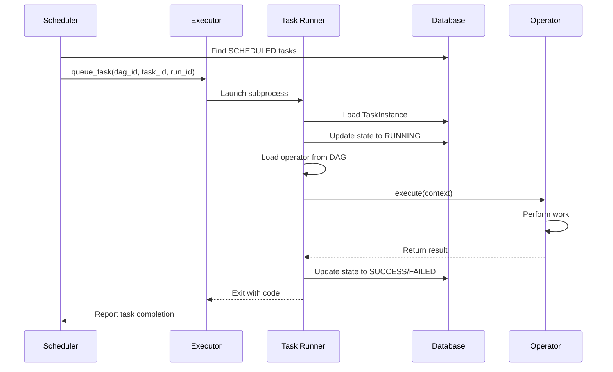

# Architecture Guide

This document provides a comprehensive overview of Spiralarr's architecture, focusing on the 3-part execution system and component interactions.

## 🎯 Design Principles

Spiralarr follows these core design principles:

1. **AI/LLM-First**: Designed for programmatic usage by AI and LLMs, not human interfaces
2. **Simplicity**: Keep the core functionality minimal and focused
3. **Modularity**: Components should be loosely coupled and easily replaceable
4. **Reliability**: Robust error handling and state management
5. **Performance**: Efficient execution with minimal overhead

## ⏰ Datetime Handling

**UTC-Only Policy**: Spiralarr is designed for AI/LLM consumption, not human users. Therefore:

- ✅ **All datetimes are UTC** - no timezone complexity
- ✅ **Input conversion** - any datetime input is immediately converted to UTC
- ✅ **Storage as UTC** - database stores all timestamps in UTC
- ✅ **Processing in UTC** - all internal operations use UTC

This eliminates timezone-related bugs and keeps the system simple for programmatic usage.

## 🏗️ System Overview

Spiralarr is built around a clean, modular architecture that separates concerns and enables reliable task execution. The system consists of three main execution components and several supporting modules.

```
┌───────────────────────────────────────────────────────────────┐
│                        Spiralarr System                    │
├───────────────────────────────────────────────────────────────┤
│                                                               │
│  ┌─────────────┐    ┌──────────────┐    ┌─────────────┐       │
│  │  Scheduler  │───▶│   Executor   │───▶│ Task Runner │       │
│  │             │    │              │    │             │       │
│  │ scheduler   │    │ LocalExecutor│    │ run-task    │       │
│  │ command     │    │ (built-in)   │    │ command     │       │
│  └─────────────┘    └──────────────┘    └─────────────┘       │
│         │                   │                   │             │
│         ▼                   ▼                   ▼             │
│  ┌─────────────────────────────────────────────────────────┐  │
│  │                    Database                             │  │
│  │  • DAG Models      • Task Instances    • DAG Runs       │  │
│  │  • State Tracking  • Execution Logs    • Metadata       │  │
│  └─────────────────────────────────────────────────────────┘  │
│                                                               │
│  ┌─────────────┐    ┌──────────────┐    ┌─────────────┐       │
│  │ Operators   │    │ DAG Loader   │    │ FastAPI     │       │
│  │ • Python    │    │ • File Parse │    │ • REST API  │       │
│  │ • Bash      │    │ • Task Load  │    │ • Health    │       │
│  │ • Base      │    │ • Validation │    │ • Control   │       │
│  └─────────────┘    └──────────────┘    └─────────────┘       │
└───────────────────────────────────────────────────────────────┘
```

## 🔄 3-Part Execution System

The core of Spiralarr is the 3-part execution system that provides clean separation of concerns and reliable task execution.

### 1. Scheduler Component

**Location**: `spiralarr.scheduler.scheduler`
**Command**: `spiralarr scheduler`

**Responsibilities**:
- Continuously scan for schedulable tasks
- Create DAG runs based on schedule intervals
- Find tasks ready for execution (SCHEDULED state)
- Submit tasks to the executor
- Handle zombie task detection and cleanup
- Manage DAG parsing and loading

**Key Features**:
- **Graceful Shutdown**: Handles SIGINT/SIGTERM properly
- **Database Initialization**: Auto-initializes DB if needed
- **Continuous Operation**: Runs until explicitly stopped
- **Error Recovery**: Handles database connection issues

**Execution Flow**:
```python
while running:
    # 1. Parse DAG files and update database
    # 2. Create new DAG runs if scheduled
    # 3. Find tasks in SCHEDULED state
    # 4. Submit tasks to executor
    # 5. Check for zombie tasks
    # 6. Sleep for configured interval
```

### 2. Executor Component

**Location**: `spiralarr.executors.local`
**Type**: Built-in LocalExecutor

**Responsibilities**:
- Manage multiprocessing pool for task execution
- Queue tasks when at capacity
- Launch Task Runner processes
- Monitor process lifecycle and completion
- Handle process timeouts and failures
- Provide capacity management

**Key Features**:
- **Capacity Management**: Configurable max parallelism
- **Process Pool**: Efficient subprocess management
- **Timeout Handling**: Automatic process termination
- **Queue Management**: FIFO task queuing when at capacity
- **Graceful Shutdown**: Clean process termination

**Public Interface**:
```python
class LocalExecutor:
    def queue_task(self, task_key: Tuple[str, str, str]) -> None
    def check_for_finished_tasks(self) -> List[Tuple[str, str, str]]
    def shutdown(self) -> None
    def get_executor_stats(self) -> Dict[str, int]
```

### 3. Task Runner Component

**Location**: `spiralarr.task_runner.runner`
**Command**: `spiralarr run-task <dag_id> <task_id> <run_id>`

**Responsibilities**:
- Load specific task instance from database
- Load task operator from DAG files
- Create execution context
- Execute task with proper lifecycle management
- Update task state in database
- Handle errors and exceptions

**Key Features**:
- **Database State Management**: Atomic state transitions
- **Context Building**: Rich execution context for operators
- **Error Handling**: Comprehensive exception management
- **Operator Loading**: Dynamic operator instantiation
- **Lifecycle Hooks**: Pre/post execution hooks

**Execution Flow**:
```python
def run_task(dag_id, task_id, run_id):
    # 1. Load TaskInstance from database
    # 2. Update state to RUNNING
    # 3. Load operator from DAG file
    # 4. Build execution context
    # 5. Execute operator with lifecycle management
    # 6. Update final state (SUCCESS/FAILED)
    # 7. Commit transaction
```

## 🧩 Core Components

### Operators

**Location**: `spiralarr.operators`

Operators define what actually gets executed when a task runs.

#### BaseOperator
- Abstract base class for all operators
- Provides common functionality and interface
- Handles validation and lifecycle hooks
- Manages task metadata and configuration

```python
class BaseOperator(ABC):
    def __init__(self, task_id: str, **kwargs)
    def execute(self, context: Dict[str, Any]) -> Any  # Abstract
    def pre_execute(self, context: Dict[str, Any]) -> None
    def post_execute(self, context: Dict[str, Any], result: Any) -> None
    def validate_parameters(self) -> None
```

#### PythonOperator
- Executes Python functions
- Supports arguments and keyword arguments
- Context-aware execution
- Parameter validation

**Features**:
- Function signature inspection
- Automatic context injection
- Error handling with detailed messages
- Support for return values

#### BashOperator
- Executes shell commands
- Template support for dynamic commands
- Environment variable injection
- Timeout and error handling

**Features**:
- Command templating with context variables
- Custom environment variables
- Working directory specification
- Timeout configuration

### DAG Loader

**Location**: `spiralarr.utils.dag_loader`

**Responsibilities**:
- Load DAG configurations from Python files
- Resolve Python callables for PythonOperator
- Create operator instances dynamically
- Handle DAG file parsing errors

**Key Features**:
- **File Discovery**: Automatic DAG file scanning
- **Configuration Parsing**: Extract DAG configs from Python modules
- **Operator Factory**: Create operators from configuration
- **Error Handling**: Graceful handling of invalid DAG files

### Database Models

**Location**: `spiralarr.models`

#### Core Models
- **DagModel**: DAG metadata and configuration
- **DagRun**: Specific execution instance of a DAG
- **TaskInstance**: Individual task execution state

#### State Management
- **State Transitions**: Validated state changes
- **Timestamps**: Automatic timing metadata
- **Relationships**: Proper foreign key relationships

### Context System

**Location**: `spiralarr.utils.context`

**Responsibilities**:
- Build rich execution context for operators
- Provide task metadata and timing information
- Support templating variables
- Validate context completeness

**Context Structure**:
```python
context = {
    # Core identifiers
    "dag_id": str,
    "task_id": str,
    "run_id": str,

    # Timing information
    "execution_date": datetime,
    "logical_date": datetime,
    "ds": str,  # YYYY-MM-DD format
    "ds_nodash": str,  # YYYYMMDD format

    # Object references
    "task_instance": TaskInstance,
    "dag_run": DagRun,

    # Configuration
    "params": dict,
    "conf": dict,
}
```

## 🔄 Execution Flow

### Complete Task Execution



### State Transitions

```
SCHEDULED → QUEUED → RUNNING → SUCCESS
                              ↘ FAILED
```

**Valid Transitions**:
- `SCHEDULED` → `QUEUED` (Scheduler queues task)
- `QUEUED` → `RUNNING` (Task Runner starts execution)
- `RUNNING` → `SUCCESS` (Task completes successfully)
- `RUNNING` → `FAILED` (Task fails or times out)
- `FAILED` → `QUEUED` (Task retry)

## ⚙️ Configuration

### Environment Variables

| Variable | Default | Description |
|----------|---------|-------------|
| `AIRFLOW_LITE_DATABASE_URL` | `sqlite:///spiralarr.db` | Database connection |
| `AIRFLOW_LITE_API_HOST` | `127.0.0.1` | API server host |
| `AIRFLOW_LITE_API_PORT` | `8080` | API server port |
| `AIRFLOW_LITE_LOG_LEVEL` | `INFO` | Logging level |

### Settings

**Location**: `spiralarr.config.settings`

```python
class Settings:
    database_url: str
    executor_parallelism: int = 4
    task_timeout: int = 3600  # 1 hour
    scheduler_interval: int = 5  # seconds
```

## 🔍 Monitoring and Observability

### Logging
- Structured logging throughout the system
- Component-specific log messages
- Error tracking and debugging information
- Performance metrics

### Health Checks
- Database connectivity
- Component status
- Resource utilization
- Task execution metrics

### API Endpoints
- `GET /api/v1/health` - System health status
- Future: Task status, DAG management, metrics

## 🚀 Performance Characteristics

### Scalability
- **Local Execution**: Single-machine multiprocessing
- **Database**: SQLite optimized for concurrent access
- **Memory**: Minimal footprint (~50MB base)
- **Startup**: Fast initialization (<2 seconds)

### Reliability
- **Atomic Transactions**: Per-task database commits
- **Zombie Detection**: Automatic cleanup of stale tasks
- **Error Recovery**: Graceful handling of failures
- **State Consistency**: Database as source of truth

## 🔮 Future Architecture

### Planned Enhancements
- **Distributed Execution**: Multi-node support
- **Advanced Operators**: HTTP, SQL, File operators
- **Workflow Features**: Dependencies, retries, sensors
- **Monitoring**: Metrics collection and dashboards
- **Security**: Authentication and authorization
